## Geltungsbereich

### 1. Organisatorische Gliederung

```mermaid
graph TB
    A[CEO]
    A --> B[Standort Mars - Technik & Entwicklung]
    A --> C[Standort Venus - Kunst & Design]
    A --> D[Standort Mond - Marketing & Vertrieb]
    
    B --> B1[Leiter Technik]
    B1 --> B1a{Backend-Entwickler}
    B1 --> B1b{Frontend-Entwickler}
    B1 --> B1c{DevOps-Ingenieure}
    B1 --> B1d{Qualitätssicherung}
    
    B --> B2[Leiter Entwicklung]
    B2 --> B2a{Spieldesigner}
    B2 --> B2b{Level-Designer}
    B2 --> B2c{Gameplay-Programmierer}
    B2 --> B2d{KI-Entwickler}
    
    C --> C1[Leiter Kunst]
    C1 --> C1a{Grafikdesigner}
    C1 --> C1b{Charakterdesigner}
    C1 --> C1c{3D-Modellierer}
    C1 --> C1d{Animationskünstler}
    
    C --> C2[Leiter Design]
    C2 --> C2a{UI/UX-Designer}
    C2 --> C2b{Konzeptkünstler}
    C2 --> C2c{Storyboard-Künstler}
    C2 --> C2d{Textur- und Lichtkünstler}
    
    D --> D1[Leiter Marketing]
    D1 --> D1a{Social Media Manager}
    D1 --> D1b{PR-Manager}
    D1 --> D1c{Content-Ersteller}
    D1 --> D1d{Event-Manager}
    
    D --> D2[Leiter Vertrieb]
    D2 --> D2a{Sales Manager}
    D2 --> D2b{Kundenbetreuung}
    D2 --> D2c{Vertriebsstrategen}
    D2 --> D2d{E-Commerce-Manager}

    classDef red fill:#b0102d,stroke:#333,stroke-width:4px;
    classDef blue fill:#4842f5,stroke:#333,stroke-width:4px;
    classDef orange fill:#f58a42,stroke:#333,stroke-width:4px;
    classDef green fill:#34a853,stroke:#333,stroke-width:4px;
    class A red
    class B,C,D blue
    class B1,B2,C1,C2,D1,D2 green
    class B1a,B1b,B1c,B1d,B2a,B2b,B2c,B2d,C1a,C1b,C1c,C1d,C2a,C2b,C2c,C2d,D1a,D1b,D1c,D1d,D2a,D2b,D2c,D2d orange

```

### 2. Standorte

1. **Standort Mond**
   - 300 Mitarbeiter
2. **Standort Mars**
   - 200 Mitarbeiter
3. **Standort Venus**
   - 166 Mitarbeiter

#### 3 Standorte sind:
- Standort Mond mit 300 Mitarbeitern
- Standort Mars mit 200 Mitarbeitern
- Standort Venus mit 166 Mitarbeitern

### 3. Vereinfachter Netzplan
```mermaid
direction TB
root[Unternehmensnetzwerk]
    subgraph "Internes Netzwerk"
        sw1[Switch]
            cli1[Client 1]
            cli2[Client 2]
            cli3[Client 3]
        srv1[Server]
            db[DB-Server]
            app[App-Server]
    end
    subgraph "DMZ (Demilitarisierte Zone)"
        sw2[Switch DMZ]
            web[Web-Server]
            mail[Mail-Server]
    end
    fw1[Firewall 1]
    fw2[Firewall 2]
    r1[Router]
        int[Internet]
    vpn[VPN-Server]

fw1 --> sw1
fw1 --> fw2
fw2 --> sw2
sw1 --> cli1
sw1 --> cli2
sw1 --> cli3
sw1 --> srv1
srv1 --> db
srv1 --> app
sw2 --> web
sw2 --> mail
r1 --> fw1
r1 --> vpn
vpn --> int
r1 --> int
```

- Standorte sind mit geheimen Satelliten verbunden.
- An jedem Standort ist jeder Mitarbeiter von 100m Beton voneinander getrennt.
- Die Kabel, die sie miteinander verbinden, sind aus Titan.

### 4. Eigenes Betriebssystem

- Console only
