## Geltungsbereich

### 1. Organisatorische Gliederung

```mermaid
graph TB
    A[CEO]
    A --> B[Standort Mars - Technik & Entwicklung]
    A --> C[Standort Venus - Kunst & Design]
    A --> D[Standort Mond - Marketing & Vertrieb]
    B --> B1[Leiter Technik]
    B --> B2[Leiter Entwicklung]
    B1 --> B1a{Programmierer}
    B1 --> B1b{Technischer Direktor}
    B2 --> B2a{Spieldesigner}
    B2 --> B2b{Level-Designer}
    C --> C1[Leiter Kunst]
    C --> C2[Leiter Design]
    C1 --> C1a{Grafikdesigner}
    C1 --> C1b{Charakterdesigner}
    C2 --> C2a{UI/UX-Designer}
    C2 --> C2b{Konzeptkünstler}
    D --> D1[Leiter Marketing]
    D --> D2[Leiter Vertrieb]
    D1 --> D1a{Social Media Manager}
    D1 --> D1b{PR-Manager}
    D2 --> D2a{Sales Manager}
    D2 --> D2b{Kundenbetreuung}

    classDef red fill:#b0102d,stroke:#333,stroke-width:4px;
    classDef blue fill:#4842f5,stroke:#333,stroke-width:4px;
    classDef orange fill:#f58a42,stroke:#333,stroke-width:4px;
    classDef green fill:#34a853,stroke:#333,stroke-width:4px;
    class A red
    class B,C,D blue
    class B1,B2,C1,C2,D1,D2 green
    class B1a,B1b,B2a,B2b,C1a,C1b,C2a,C2b,D1a,D1b,D2a,D2b orange
```

### 2. Standorte

1. **Standort Mond**
   - 300 Mitarbeiter
2. **Standort Mars**
   - 200 Mitarbeiter
3. **Standort Venus**
   - 166 Mitarbeiter

#### 3 Standorte sind:
- Standort Mond mit 300 Mitarbeitern
- Standort Mars mit 200 Mitarbeitern
- Standort Venus mit 166 Mitarbeitern

### 3. Vereinfachter Netzplan

- Standorte sind mit geheimen Satelliten verbunden.
- An jedem Standort ist jeder Mitarbeiter von 100m Beton voneinander getrennt.
- Die Kabel, die sie miteinander verbinden, sind aus Titan.

### 4. Eigenes Betriebssystem

- Console only
